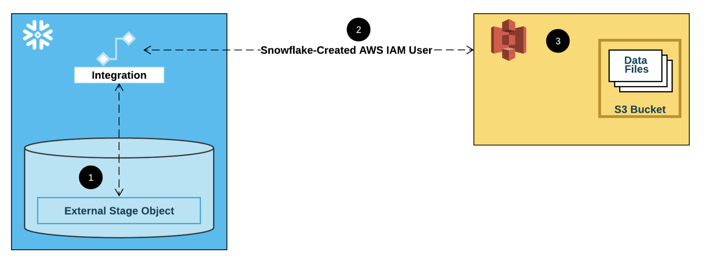

# Amplitude Analytics Data Exporter

Free, open-source ETL pipeline for Amplitude Analytics → S3. A lightweight alternative to Airbyte with production-grade features: automated scheduling, retry logic, S3 sync, and comprehensive logging.



## Features

- **Fetch & backfill** - Query Amplitude API and save hourly snapshots locally
- **Smart S3 optimization** - Auto-adjusts fetch range based on existing S3 data to reduce API calls
- **S3 sync** - Upload to S3, prevent duplicates, auto-cleanup
- **Smart retry logic** - Handles rate limits (429) and server errors (5xx)
- **CLI interface** - Simple commands: `fetch`, `sync`, `all`
- **EU compliant** - Uses Amplitude EU residency server

## Quick Start

1. **Install dependencies**
   ```bash
   pip install -r requirements.txt
   ```

2. **Configure credentials** - Create `.env` file:
   ```env
   AMP_API_KEY=your_amplitude_api_key
   AMP_SECRET_KEY=your_amplitude_secret_key
   AWS_BUCKET_NAME=your-s3-bucket
   AWS_REGION=eu-west-2
   AWS_PYTHON_USER_ACCESS_KEY=your_aws_key
   AWS_PYTHON_USER_SECRET_KEY=your_aws_secret
   ```

3. **Run**
   ```bash
   python run.py fetch    # Fetch data from Amplitude (last 1 day)
   python run.py sync     # Upload to S3 and cleanup local files
   python run.py all      # Complete pipeline (fetch + sync)
   python run.py all --dev  # Dev mode: use local s3_dev/ folder (no AWS calls)
   ```

## Usage

### Commands

```bash
# Fetch data for specific date range
python run.py fetch --start-date 20251110T00 --end-date 20251110T23

# Sync local files to S3
python run.py sync

# Run complete workflow (fetch + sync)
python run.py all

# Development mode: use local s3_dev/ folder instead of AWS S3
python run.py all --dev
```

### Architecture

```
┌──────────────────────────┐
│     Amplitude API        │
│  (EU Residency Server)   │
└────────────┬─────────────┘
             │ ① Fetch hourly data
             ▼
┌──────────────────────────┐
│    Local Storage         │
│  data/2025-11-10_21.jsonl│
└────────────┬─────────────┘
             │ ② Sync & upload
             ▼
┌──────────────────────────┐
│      AWS S3 Bucket       │
│  python-import/*.jsonl   │
└──────────────────────────┘
```

**Data Flow:**
1. **Amplitude API** → Fetch hourly event data (JSONL files)
2. **Local Storage** → Store as hourly snapshots (`data/2025-11-10_21.jsonl`)
3. **S3 Sync** → Upload to S3, remove duplicates, cleanup local files

### What Each Command Does

**`fetch`** - Fetching & backfilling
- **S3 optimization check** - Check S3 for continuous data, adjust start date if found
- Generate required hourly files (start → end range)
- Get existing local files
- Calculate missing files (required - local)
- Query Amplitude API for missing hours
- Save as `data/YYYY-MM-DD_HH.jsonl`

**`sync`** - S3 syncing
- Get local files
- Get remote S3 files
- Remove local files already in S3 (prevent duplicates)
- Push remaining files to S3 (`python-import/` prefix)
- Cleanup local files after successful upload

**`all`** - Complete pipeline
- Run `fetch` workflow
- Run `sync` workflow

### File Format

**Hourly snapshots**: `data/2025-11-10_21.jsonl`
- One file per hour
- JSONL format (newline-delimited JSON)
- Uploaded to: `s3://bucket/python-import/2025-11-10_21.jsonl`

### Development Mode

Use `--dev` flag to avoid AWS API calls during development:
- S3 operations use local `s3_dev/` folder instead of AWS
- Perfect for testing without incurring AWS costs
- Simulates full S3 workflow locally

## Scheduling

**Cron (Linux/macOS)**
```bash
# Run hourly
0 * * * * cd /path/to/amplitude && python run.py all
```

**GitHub Actions**
```yaml
on:
  schedule:
    - cron: '0 * * * *'  # Every hour
```

## License

MIT
