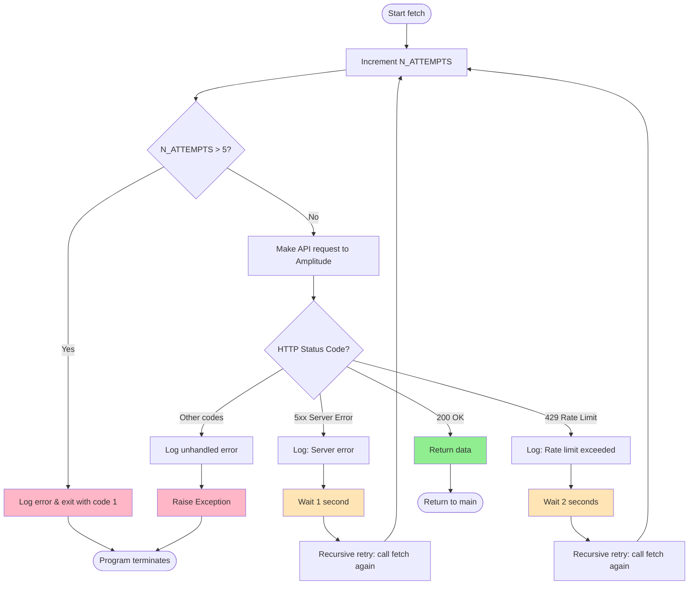

# Amplitude Analytics Data Exporter

A Python script that fetches event data from Amplitude's EU residency API server and stores it locally as JSON files. The tool is designed to export historical event data with robust retry logic for handling transient failures. Data can be subsequently loaded into Azure Blob Storage for long-term analytics and reporting.

## High-Level Architecture


## Value Proposition

- **Automated Data Extraction**: Eliminates manual export processes from Amplitude UI
- **Resilient & Reliable**: Built-in retry logic ensures data isn't lost due to transient API failures
- **EU GDPR Compliant**: Uses EU residency server for data sovereignty requirements
- **Cloud-Ready**: Prepared for Azure Blob Storage integration for scalable analytics
- **Audit Trail**: Comprehensive logging for compliance and debugging
- **Cost-Effective**: Lightweight Python solution with minimal infrastructure requirements

## Features

- **Automatic Daily Export**: Fetches previous day's events (00:00-23:00)
- **Resilient Retry Logic**: Handles server errors and rate limits with configurable retries
- **EU Compliance**: Uses Amplitude's EU residency server
- **Comprehensive Logging**: Timestamped logs for audit trails
- **Automatic Date Handling**: Calculates date ranges automatically
- **Error Handling**: Graceful handling of API failures with exponential backoff
- **Azure Integration Ready**: Configured for Azure Blob Storage (Germany West Central)

## Prerequisites

- Python 3.12 or higher
- Amplitude API credentials (API key and secret key)
- Internet connection to access Amplitude API

## Installation

1. **Clone the repository**:
   ```bash
   git clone <repository-url>
   cd amplitude
   ```

2. **Install dependencies**:
   ```bash
   pip install -r requrements.txt
   ```

3. **Configure environment variables**:
   Create a `.env` file in the project root:
   ```env
   AMP_API_KEY=your_api_key_here
   AMP_SECRET_KEY=your_secret_key_here
   ```

## Configuration

### Environment Variables (`.env`)

| Variable | Description |
|----------|-------------|
| `AMP_API_KEY` | Your Amplitude API key |
| `AMP_SECRET_KEY` | Your Amplitude secret key |

### Script Configuration ([fetch_data.py](fetch_data.py))

| Parameter | Default | Description |
|-----------|---------|-------------|
| `log_outpath` | `"logs"` | Directory for log files |
| `log_level` | `logging.INFO` | Logging level |
| `data_outpath` | `"data"` | Directory for exported data |
| `data_outfile` | `"ampl_dump"` | Base name for data files |
| `max_attempts` | `5` | Maximum retry attempts |
| `delay_seconds` | `1` | Base delay between retries |

## Usage

Run the script to fetch yesterday's data:

```bash
python fetch_data.py
```

### What Happens:

1. Calculates the previous day's date range (T00 to T23)
2. Authenticates with Amplitude API using credentials from `.env`
3. Fetches event data from `https://analytics.eu.amplitude.com/api/2/export`
4. Retries automatically on failures (up to 5 attempts)
5. Extracts and decompresses the zip archive
6. Saves events to `data/YYYYMMDD_HHMM_ampl_dump.json`
7. Logs all operations to `logs/log_YYYYMMDD_HHMMSS.log`

## Retry Logic

The script implements a robust retry mechanism to handle transient API failures:



### Retry Strategy Details:

| Error Type | HTTP Code | Wait Time | Action |
|------------|-----------|-----------|--------|
| Server Errors | 500, 502, 503, 504, etc. | 1 second | Retry recursively |
| Rate Limiting | 429 | 2 seconds | Retry recursively |
| Success | 200 | N/A | Return data |
| Unhandled | All others | N/A | Raise exception |
| Max Attempts | Any (after 5 tries) | N/A | Exit program |

**Key Implementation Details:**
- **Type**: Recursive retry with linear backoff
- **Global Counter**: `N_ATTEMPTS` tracks total attempts across all retries
- **Max Attempts**: 5 retries before giving up
- **Delay Strategy**: Fixed delays (not exponential)
  - 5xx errors: 1 second
  - 429 errors: 2 seconds (2x base delay)
- **Logging**: Every attempt and error is logged

## Architecture

### Components

```
amplitude/
├── fetch_data.py           # Main application script
├── logging_config.py       # Logging configuration
├── .env                    # API credentials (not in git)
├── requrements.txt         # Python dependencies
├── .gitignore             # Git ignore patterns
├── data/                  # Exported JSON files (created at runtime)
└── logs/                  # Application logs (created at runtime)
```

### Main Functions

| Function | Location | Purpose |
|----------|----------|---------|
| `fetch()` | [fetch_data.py:48-89](fetch_data.py#L48-L89) | Fetches data from Amplitude API with retry logic |
| `unzip()` | [fetch_data.py:36-45](fetch_data.py#L36-L45) | Extracts and decompresses event data |
| `write_to_local()` | [fetch_data.py:92-101](fetch_data.py#L92-L101) | Saves events to timestamped JSON file |
| `setup_logging()` | [logging_config.py:4-18](logging_config.py#L4-L18) | Configures logging with timestamps |

### Data Flow

```
1. Load .env credentials
   ↓
2. Calculate yesterday's date range
   ↓
3. Make API request to Amplitude
   ↓
4. [Retry Logic] Handle failures automatically
   ├→ 5xx errors: wait 1s, retry
   ├→ 429 errors: wait 2s, retry
   └→ max 5 attempts
   ↓
5. Receive raw zip bytes
   ↓
6. Unzip → Decompress gzip → Parse JSON lines
   ↓
7. Write to data/TIMESTAMP_ampl_dump.json
   ↓
8. Log success
```

## Output

### Data Files

**Location**: `data/` directory
**Format**: `YYYYMMDD_HHMM_ampl_dump.json`
**Example**: `20251107_0043_ampl_dump.json`

**Structure**: JSON array of event objects
```json
[
  {
    "event_type": "page_view",
    "user_id": "12345",
    "time": 1699286400000,
    ...
  }
]
```

### Log Files

**Location**: `logs/` directory
**Format**: `log_YYYYMMDD_HHMMSS.log`
**Example**: `log_20251107_004312.log`

**Log Entry Format**:
```
2025-11-07 00:43:12,345 - INFO - Data fetched successfully (status 200)
```

## Error Handling

### Common Scenarios

1. **Missing Credentials**: Script will fail if `.env` file is missing or incomplete
2. **Network Errors**: Automatically retried up to 5 times
3. **Rate Limiting**: Waits 2 seconds before retrying
4. **Server Errors**: Waits 1 second before retrying
5. **Max Retries Exceeded**: Program exits with error code 1

### Exit Codes

| Code | Meaning |
|------|---------|
| 0 | Success |
| 1 | Max retry attempts exceeded |

## Dependencies

See [requrements.txt](requrements.txt) for full list:

- **requests** (2.32.5): HTTP library for API calls
- **python-dotenv** (1.2.1): Loads environment variables
- **logging** (0.4.9.6): Logging functionality

## Troubleshooting

### Issue: "Max fetch attempts reached"
**Solution**: Check your internet connection and Amplitude API status. Verify credentials in `.env`.

### Issue: Empty data files
**Solution**: Verify the date range has events. Check Amplitude dashboard for data availability.

### Issue: "ModuleNotFoundError"
**Solution**: Run `pip install -r requrements.txt` to install dependencies.

## Contributing

When modifying the retry logic, ensure:
1. Update the `max_attempts` constant if changing retry limits
2. Adjust `delay_seconds` for different backoff strategies
3. Update the retry diagram in this README
4. Test with various failure scenarios

## License

[Add your license information here]

## Contact

[Add contact information here]
