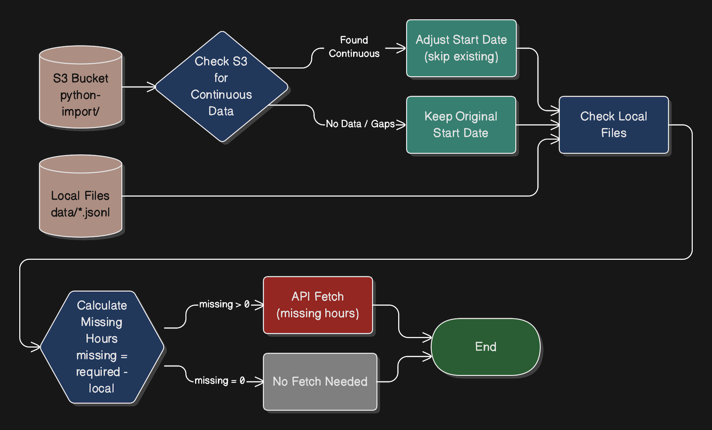
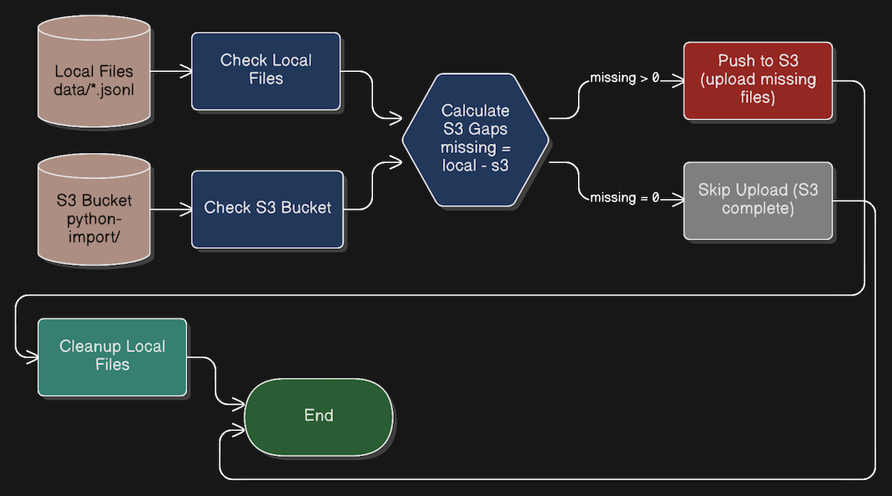

# API to S3 Hourly Syncing and Backfilling

Self-hosted ETL pipeline for REST API → S3. Skip expensive cloud ETL services. Get production-grade features (retry logic, S3 sync, scheduling) in a simple, transparent Python script.

The pipeline consists of two workflows: **Fetching** (query Amplitude API for hourly event data) and **Syncing** (upload to S3 with duplicate prevention and cleanup). The workflows can be triggered via CLI. Run the commands with the `--dev` flag to simulate s3 as local folder instead. Anything about to be sent to s3 will then go there instead.

---

## `Fetching Workflow` - Fetching & Backfilling
- `python run.py fetch`
- **S3 optimization check** - Check S3 for continuous data, adjust start date if found
- Generate required hourly files (start → end range)
- Get existing local files
- Calculate missing files (required - local)
- Query Amplitude API for missing hours
- Save as `data/YYYY-MM-DD_HH.jsonl`




## `Syncing Workflow` - S3 syncing
- `python run.py sync`
- Get local files
- Get remote S3 files
- Remove local files already in S3 (prevent duplicates)
- Push remaining files to S3 (`python-import/` prefix)
- Cleanup local files after successful upload



---

## Quick Start

1. **Install dependencies**
   ```bash
   pip install -r requirements.txt
   ```

2. **Configure credentials** - Create `.env` file:
   ```env
   AMP_API_KEY=your_amplitude_api_key
   AMP_SECRET_KEY=your_amplitude_secret_key
   AWS_BUCKET_NAME=your-s3-bucket
   AWS_REGION=eu-west-2
   AWS_PYTHON_USER_ACCESS_KEY=your_aws_key
   AWS_PYTHON_USER_SECRET_KEY=your_aws_secret
   ```

3. **Run**
   ```bash
   python run.py fetch    # Fetch data from Amplitude (last 1 day)
   python run.py sync     # Upload to S3 and cleanup local files
   python run.py all      # Complete pipeline (fetch + sync)
   python run.py all --dev  # Dev mode: use local s3_dev/ folder (no AWS calls)
   ```

## Usage

### Commands

```bash
# Fetch data for specific date range
python run.py fetch --start-date 20251110T00 --end-date 20251110T23

# Sync local files to S3
python run.py sync

# Run complete workflow (fetch + sync)
python run.py all

# Development mode: use local s3_dev/ folder instead of AWS S3
python run.py all --dev
```


### File Format

**Hourly snapshots**: `data/2025-11-10_21.jsonl`
- One file per hour
- JSONL format (newline-delimited JSON)
- Uploaded to: `s3://bucket/python-import/2025-11-10_21.jsonl`

### Development Mode

Use `--dev` flag to avoid AWS API calls during development:
- S3 operations use local `s3_dev/` folder instead of AWS
- Perfect for testing without incurring AWS costs
- Simulates full S3 workflow locally

## Scheduling

**Cron (Linux/macOS)**
```bash
# Run hourly
0 * * * * cd /path/to/amplitude && python run.py all
```

**GitHub Actions**
```yaml
on:
  schedule:
    - cron: '0 * * * *'  # Every hour
```

## License

MIT
